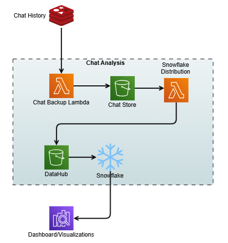

*By Samit Verma, Eusha Rizvi, Manmeet Singh, Troy Smith, Corey Finley, Arun Pradeep Selvaraj, and Ryan Doty – posted on 16 SEP 2025 | Topics: [Amazon Bedrock](https://aws.amazon.com/blogs/machine-learning/category/artificial-intelligence/amazon-machine-learning/amazon-bedrock/), [Amazon ElastiCache](https://aws.amazon.com/blogs/machine-learning/category/database/amazon-elasticache/), [Amazon OpenSearch Service](https://aws.amazon.com/blogs/machine-learning/category/analytics/amazon-elasticsearch-service/), [Artificial Intelligence](https://aws.amazon.com/blogs/machine-learning/category/artificial-intelligence/), [Customer Solutions](https://aws.amazon.com/blogs/machine-learning/category/post-types/customer-solutions/), [Generative AI](https://aws.amazon.com/blogs/machine-learning/category/artificial-intelligence/generative-ai/)*

*This post is co-written with Samit Verma, Eusha Rizvi, Manmeet Singh, Troy Smith, and Corey Finley from Verisk.*

Verisk Rating Insights, as a feature of [ISO Electronic Rating Content (ERC)](https://www.verisk.com/insurance/products/iso-electronic-rating-content/), is a powerful tool designed to provide summaries of ISO Rating changes between two releases.

Traditionally, extracting specific filing information or identifying differences across multiple releases required manual downloads of full packages, which was time-consuming and prone to inefficiencies.

This challenge, coupled with the need for accurate and timely customer support, prompted Verisk to explore innovative ways to enhance user accessibility and automate repetitive processes.

Using generative AI and [Amazon Web Services (AWS)](https://aws.amazon.com/) services, Verisk has made significant strides in creating a conversational user interface for users to easily retrieve specific information, identify content differences, and improve overall operational efficiency.

In this post, we dive into how Verisk Rating Insights, powered by [Amazon Bedrock](https://aws.amazon.com/bedrock/), large language models (LLMs), and Retrieval Augmented Generation (RAG), is transforming the way customers interact with and access ISO ERC changes.

---

**The challenge**

Rating Insights provides valuable content, but there were significant challenges with user accessibility and the time it took to extract actionable insights:

1. **Manual downloading** – Customers had to download entire packages to get even a small piece of relevant information. This was inefficient, especially when only a part of the filing needed to be reviewed.
2. **Inefficient data retrieval** – Users couldn’t quickly identify the differences between two content packages without downloading and manually comparing them, which could take hours and sometimes days of analysis.
3. **Time-consuming customer support** – Verisk’s ERC Customer Support team spent 15% of their time weekly addressing queries from customers who were impacted by these inefficiencies. Furthermore, onboarding new customers required half a day of repetitive training to ensure they understood how to access and interpret the data.
4. **Manual analysis time** – Customers often spent 3–4 hours per test case analyzing the differences between filings. With multiple test cases to address, this led to significant delays in critical decision-making.

---

**Solution overview**

To solve these challenges, Verisk embarked on a journey to enhance Rating Insights with generative AI technologies. By integrating [Anthropic’s Claude](https://aws.amazon.com/bedrock/claude/), available in Amazon Bedrock, and [Amazon OpenSearch Service](https://aws.amazon.com/opensearch-service/), Verisk created a sophisticated conversational platform where users can effortlessly access and analyze rating content changes.

The following diagram illustrates the high-level architecture of the solution, with distinct sections showing the data ingestion process and inference loop. The architecture uses multiple AWS services to add generative AI capabilities to the Rating Insights system. The system’s components work together seamlessly, coordinating multiple LLM calls to generate user responses.

The following diagram shows the architectural components and the high-level steps involved in the data ingestion process.

The steps in the data ingestion process proceed as follows:

1. The process is triggered when a new file is dropped. It is responsible for chunking the document using a custom chunking strategy. This strategy recursively checks each section and keeps them intact without overlap. The process then embeds the chunks and stores them in OpenSearch Service as vector embeddings.
2. The embedding model used in Amazon Bedrock is `amazon.titan-embed-g1-text-02`.
3. Amazon OpenSearch Serverless is utilized as a vector embedding store with metadata filtering capability.

The following diagram shows the architectural components and the high-level steps involved in the inference loop to generate user responses.

The steps in the inference loop proceed as follows:

1. This component is responsible for multiple tasks: it supplements user questions with recent chat history, embeds the questions, retrieves relevant chunks from the vector database, and finally calls the generation model to synthesize a response.
2. Amazon ElastiCache is used for storing recent chat history.
3. The embedding model utilized in Amazon Bedrock is `amazon.titan-embed-g1-text-02`.
4. OpenSearch Serverless is implemented for RAG (Retrieval-Augmented Generation).
5. For generating responses to user queries, the system uses Anthropic’s Claude Sonnet 3.5 (model ID: `anthropic.claude-3-5-sonnet-20240620-v1:0`), which is available through Amazon Bedrock.

---

**Key technologies and frameworks used**

We used Anthropic’s Claude Sonnet 3.5 (model ID: `anthropic.claude-3-5-sonnet-20240620-v1:0`) to understand user input and provide detailed, contextually relevant responses. Anthropic’s Claude Sonnet 3.5 enhances the platform’s ability to interpret user queries and deliver accurate insights from complex content changes. **LlamaIndex**, an open source framework, served as the chain framework for efficiently connecting and managing different data sources to enable dynamic retrieval of content and insights.

We implemented RAG, which allows the model to pull specific, relevant data from the OpenSearch Serverless vector database. This means the system generates precise, up-to-date responses based on a user’s query without needing to sift through massive content downloads. The vector database enables intelligent search and retrieval, organizing content changes in a way that makes them quickly and easily accessible. This eliminates the need for manual searching or downloading of entire content packages. Verisk applied guardrails in [Amazon Bedrock Guardrails](https://aws.amazon.com/bedrock/guardrails/) along with custom guardrails around the generative model so the output adheres to specific compliance and quality standards, safeguarding the integrity of responses.

Verisk’s generative AI solution is a comprehensive, secure, and flexible service for building generative AI applications and agents. Amazon Bedrock connects you to leading FMs, services to deploy and operate agents, and tools for fine-tuning, safeguarding, and optimizing models along with knowledge bases to connect applications to your latest data so that you have everything you need to quickly move from experimentation to real-world deployment.

Given the novelty of generative AI, Verisk has established a governance council to oversee its solutions, ensuring they meet security, compliance, and data usage standards. Verisk implemented strict controls within the RAG pipeline to ensure data is only accessible to authorized users. This helps maintain the integrity and privacy of sensitive information. Legal reviews ensure IP protection and contract compliance.

---

**How it works**

The integration of these advanced technologies enables a seamless, user-friendly experience. Here’s how Verisk Rating Insights now works for customers:

1. **Conversational user interface** – Users can interact with the platform by using a conversational interface. Instead of manually reviewing content packages, users enter a natural language query (for example, “What are the changes in coverage scope between the two recent filings?”). The system uses Anthropic’s Claude Sonnet 3.5 to understand the intent and provides an instant summary of the relevant changes.
2. **Dynamic content retrieval** – Thanks to RAG and OpenSearch Service, the platform doesn’t require downloading entire files. Instead, it dynamically retrieves and presents the specific changes a user is seeking, enabling quicker analysis and decision-making.
3. **Automated difference analysis** – The system can automatically compare two content packages, highlighting the differences without requiring manual intervention. Users can query for precise comparisons (for example, “Show me the differences in rating criteria between Release 1 and Release 2”).
4. **Customized insights** – The guardrails in place mean that responses are accurate, compliant, and actionable. Additionally, if needed, the system can help users understand the impact of changes and assist them in navigating the complexities of filings, providing clear, concise insights.

The following diagram shows the architectural components and the high-level steps involved in the evaluation loop to generate relevant and grounded responses.

The steps in the evaluation loop proceed as follows:

1. This component is responsible for calling Anthropic’s Claude Sonnet 3.5 model and subsequently invoking the custom-built evaluation APIs to ensure response accuracy.
2. The generation model employed is Anthropic’s Claude Sonnet 3.5, which handles the creation of responses.
3. The Evaluation API ensures that responses remain relevant to user queries and stay grounded within the provided context.

The following diagram shows the process of capturing the chat history as contextual memory and storage for analysis.

---

**Quality benchmarks**

The Verisk Rating Insights team has implemented a comprehensive evaluation framework and feedback loop mechanism, as shown in the previous figures, to support continuous improvement and address issues that might arise.

Ensuring high accuracy and consistency in responses is essential for Verisk’s generative AI solutions. However, LLMs can sometimes produce hallucinations or provide irrelevant details, affecting reliability. To address this, Verisk implemented:

* **Evaluation framework** – Integrated into the query pipeline, it validates responses for precision and relevance before delivery.
* **Extensive testing** – Product subject matter experts (SMEs) and quality experts rigorously tested the solution to ensure accuracy and reliability. Verisk collaborated with in-house insurance domain experts to develop SME evaluation metrics for accuracy and consistency. Multiple rounds of SME evaluations were conducted, where experts graded these metrics on a 1–10 scale. Latency was also tracked to assess speed. Feedback from each round was incorporated into subsequent tests to drive improvements.
* **Continual model improvement** – Using customer feedback serves as a crucial component in driving the continuous evolution and refinement of the generative models, improving both accuracy and relevance. By seamlessly integrating user interactions and feedback with chat history, a robust data pipeline is created that streams user interactions to an [Amazon Simple Storage Service](https://aws.amazon.com/s3/) (Amazon S3) bucket, which acts as a data hub. The interactions then go into Snowflake, which is a cloud-based data platform and data warehouse as a service that offers capabilities such as data warehousing, data lakes, data sharing, and data exchange. Through this integration, the team built comprehensive analytics dashboards that provide valuable insights into user experience patterns and pain points.

Although the initial results were promising, they didn’t meet the desired accuracy and consistency levels. The development process involved several iterative improvements, such as redesigning the system and making multiple calls to the LLM. The primary metric for success was a manual grading system where business experts compared the results and provided continuous feedback to improve overall benchmarks.

---

**Business impact and opportunity**

By integrating generative AI into Verisk Rating Insights, the business has seen a remarkable transformation. Customers have enjoyed significant time savings. By eliminating the need to download entire packages and manually search for differences, the time spent on analysis has been drastically reduced. Customers no longer spend 3–4 hours per test case. What once took days now takes minutes.

This time savings brings increased productivity. With an automated solution that instantly provides relevant insights, customers can focus more on decision-making rather than spending time on manual data retrieval. By automating difference analysis and providing a centralized, effortless platform, customers can be more confident in the accuracy of their results and avoid missing critical changes.

For Verisk, the benefit is a reduced customer support burden because the ERC customer support team now spends less time addressing queries. With the AI-powered conversational interface, users can self-serve and get answers in real time, freeing up support resources for more complex inquiries.

The automation of repetitive training tasks means quicker and more efficient customer onboarding. This reduces the need for lengthy training sessions, and new customers become proficient faster. The integration of generative AI has reduced redundant workflows and the need for manual intervention. This streamlines operations across multiple departments, leading to a more agile and responsive business.

---

**Conclusion**

Looking ahead, Verisk plans to continue enhancing the Rating Insights platform in two ways. First, they will expand the scope of queries, enabling more sophisticated queries related to different filing types and more nuanced coverage areas. Second, they will scale the platform. With Amazon Bedrock providing the infrastructure, Verisk aims to scale this solution further to support more users and additional content sets across various product lines.

Verisk Rating Insights, now powered by generative AI and AWS technologies, has transformed the way customers interact with and access rating content changes. Through a conversational user interface, RAG, and vector databases, Verisk intends to eliminate inefficiencies and save customers valuable time and resources while enhancing overall accessibility. For Verisk, this solution has improved operational efficiency and provided a strong foundation for continued innovation.

With Amazon Bedrock and a focus on automation, Verisk is driving the future of intelligent customer support and content management, empowering both customers and internal teams to make smarter, faster decisions.

For more information, refer to the following resources:

* [Explore generative AI on AWS](https://aws.amazon.com/generative-ai/)
* [Learn about unlocking the business value of generative AI](https://aws.amazon.com/executive-insights/generative-ai-ml/)
* [Learn more about Anthropic’s Claude 3 models on Amazon Bedrock](https://aws.amazon.com/bedrock/claude/)
* [Learn about Amazon Bedrock](https://aws.amazon.com/bedrock) and how to build and scale generative AI applications with FMs
* [Explore generative AI quick start proofs of concept](https://github.com/aws-samples/genai-quickstart-pocs)

---

**About the authors**

|    | Samit Verma serves as the Director of Software Engineering at Verisk, overseeing the Rating and Coverage development teams. In this role, he plays a key part in architectural design and provides strategic direction to multiple development teams, enhancing efficiency and ensuring long-term solution maintainability. He holds a master’s degree in information technology.                                                                                       |
| :----------- | :---------------------------------------------------------------------------------------------------------------------------------------------------------------------------------------------------------------------------------------------------------------------------------------------------------------------------------------------------------------------------------------------------------------------------------------------------------------------- |
|   | Eusha Rizvi serves as a Software Development Manager at Verisk, leading several technology teams within the Ratings Products division. Possessing strong expertise in system design, architecture, and engineering, Eusha offers essential guidance that advances the development of innovative solutions. He holds a bachelor’s degree in information systems from Stony Brook University.                                                                             |
|    | Manmeet Singh is a Software Engineering Lead at Verisk and AWS Certified Generative AI Specialist. He leads the development of an agentic RAG-based generative AI system on Amazon Bedrock, with expertise in LLM orchestration, prompt engineering, vector databases, microservices, and high-availability architecture. Manmeet is passionate about applying advanced AI and cloud technologies to deliver resilient, scalable, and business-critical systems.        |
|    | Troy Smith is a Vice President of Rating Solutions at Verisk. Troy is a seasoned insurance technology leader with more than 25 years of experience in rating, pricing, and product strategy. At Verisk, he leads the team behind ISO Electronic Rating Content, a widely used resource across the insurance industry. Troy has held leadership roles at Earnix and Capgemini and was the cofounder and original creator of the Oracle Insbridge Rating Engine.          |
|  | Corey Finley is a Product Manager at Verisk. Corey has over 22 years of experience across personal and commercial lines of insurance. He has worked in both implementation and product support roles and has led efforts for major carriers including Allianz, CNA, Citizens, and others. At Verisk, he serves as Product Manager for VRI, RaaS, and ERC.                                                                                                               |
|   | Arun Pradeep Selvaraj is a Senior Solutions Architect at Amazon Web Services (AWS). Arun is passionate about working with his customers and stakeholders on digital transformations and innovation in the cloud while continuing to learn, build, and reinvent. He is creative, energetic, deeply customer-obsessed, and uses the working backward process to build modern architectures to help customers solve their unique challenges. Connect with him on LinkedIn. |
|   | Ryan Doty is a Solutions Architect Manager at Amazon Web Services (AWS), based out of New York. He helps financial services customers accelerate their adoption of the AWS Cloud by providing architectural guidelines to design innovative and scalable solutions. Coming from a software development and sales engineering background, the possibilities that the cloud can bring to the world excite him.                                                            |
